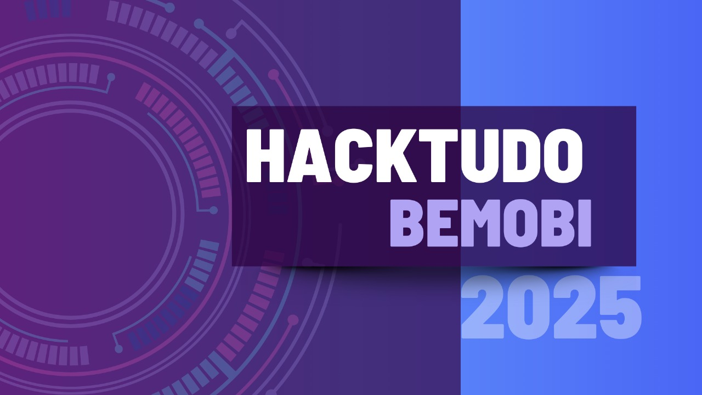

# HackTudo 25 - Equipe Root Acces 💻📱
Design do projeto criado para o HackTudo 2025 - Bemobi, pela equipe Root Acces. 

### Tema do HackTudo 25 - Bemobi
Explore soluções inovadoras que integrem IA aos ecossistemas de pagamento da Bemobi.
### Participantes da Equipe Root Access

- Amanda Veríssimo;
- [Diana Mota](https://github.com/motadianas);
- João Pedro Brito;
- [Roger Borges](https://github.com/RogerBSG)

### Design no Figma
Acesso os designs e experimente testar as respostas

👉 [Acesse o Wireframe 1 no Figma aqui](https://www.figma.com/make/7FkApENSQXaqrdZcJfREIV/Chat-App-Mockup---Diana?node-id=0-1&p=f&t=zF1riZvj8L0iiQhn-0&fullscreen=1)

👉 [Acesse o Wireframe 2 no Figma aqui](https://www.figma.com/make/ya4XmGhvfyVIW6Cwepwnce/Chat-App-with-Message-Editing?node-id=0-1&p=f&t=xfEcMclDrvPed1T0-0&fullscreen=1)

👉 [Acesse o Wireframe 3 no Figma aqui](https://www.figma.com/make/sijnHteLkM3RiQbhFRIr0s/Mobile-Chat-App-Mockup?node-id=0-1&p=f&t=s7zSbOmnegRQG6ea-0&fullscreen=1)

### Apresentação

[

### Pitch de 2 minutos
